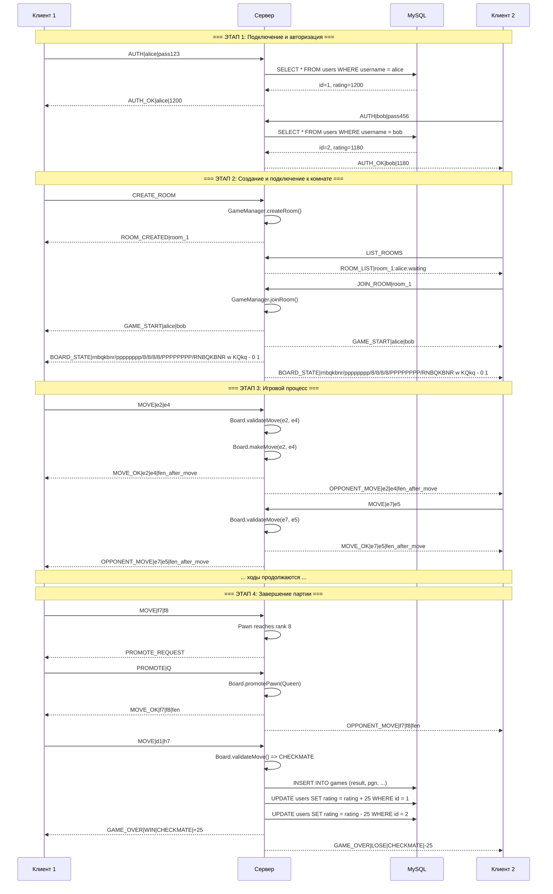
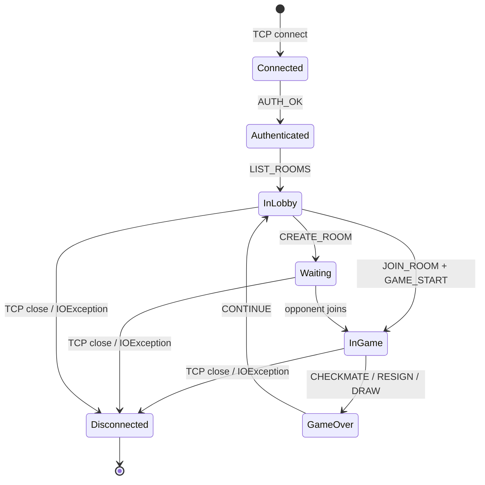
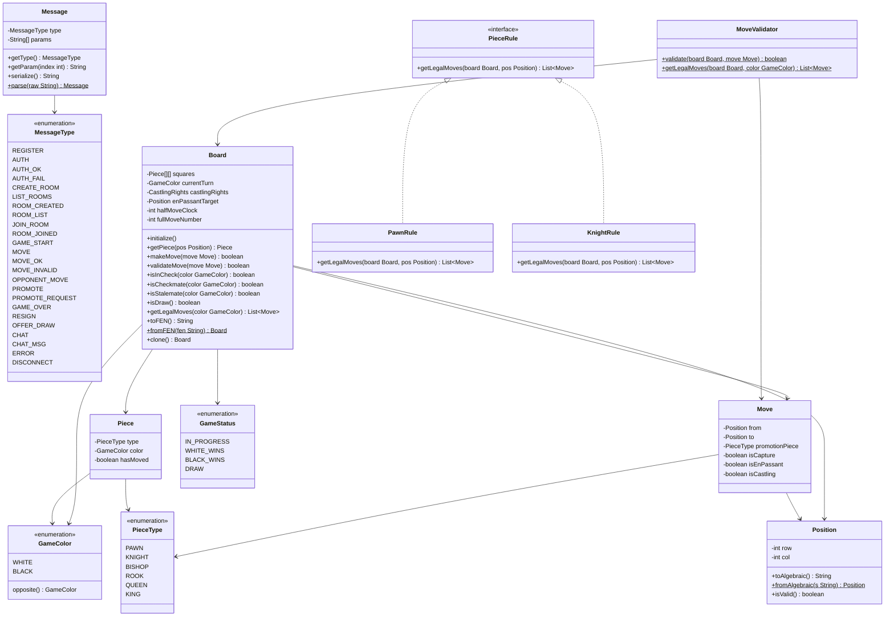
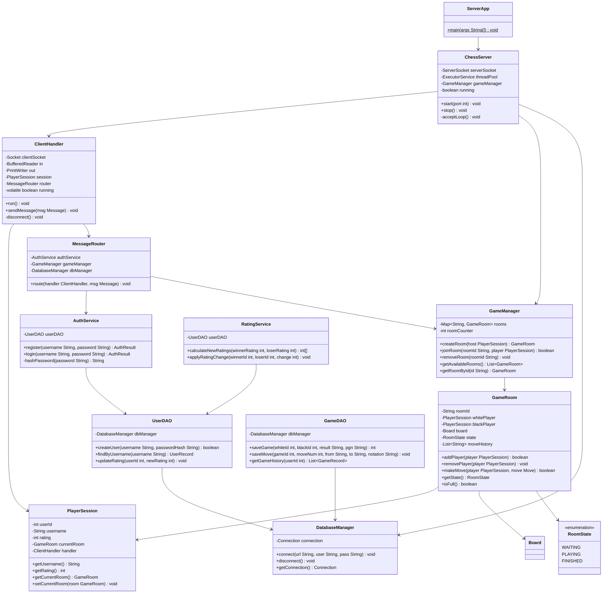
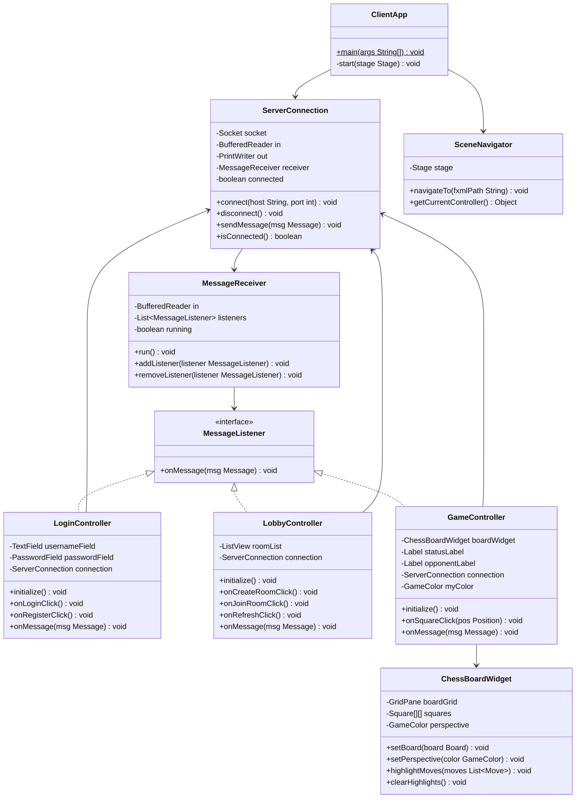
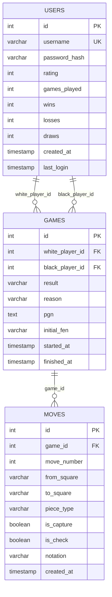
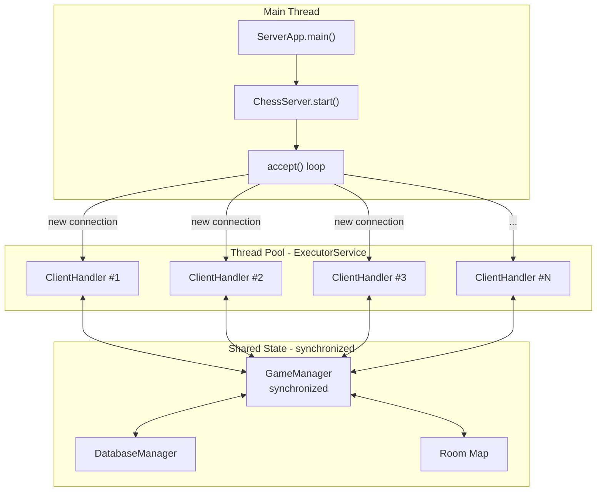
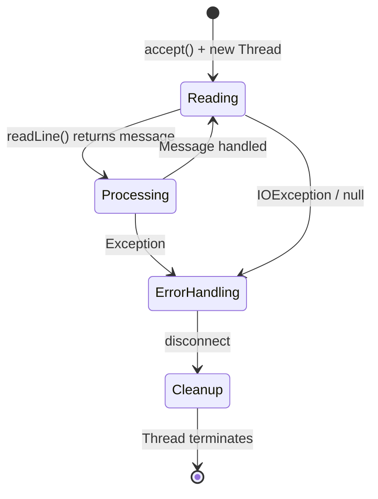
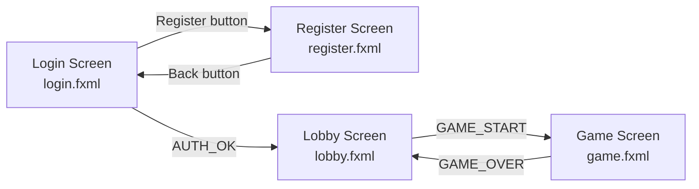

# ChessKSiS — Архитектурная документация

## Сетевая шахматная игра (Java + TCP + MySQL)

---

## 1. Обзор проекта

Приложение «Сетевые шахматы» — клиент-серверная система, позволяющая двум игрокам играть в шахматы через сеть. Сервер контролирует правила, управляет сессиями и хранит данные в MySQL. Клиент предоставляет GUI на JavaFX.

### 1.1. Стек технологий

| Компонент | Технология | Версия |
|-----------|------------|--------|
| Язык | Java | 17+ |
| GUI | JavaFX | 17+ (через Maven, openjfx) |
| Сборка | Maven | 3.9+ |
| Сеть | java.net.Socket / ServerSocket | Стандартная библиотека |
| Многопоточность | ExecutorService, Thread | Стандартная библиотека |
| БД | MySQL | 8.0.44 |
| JDBC | mysql-connector-j | 8.x |
| Логирование | java.util.logging или SLF4J | — |

### 1.2. Структура проекта (Maven Multi-Module)

```
ChessKSiS/
├── pom.xml                          # Родительский POM
├── plans/                           # Документация
│
├── chess-common/                    # Общий модуль
│   ├── pom.xml
│   └── src/main/java/
│       └── com/chess/common/
│           ├── protocol/            # Протокол общения
│           │   ├── Message.java
│           │   ├── MessageType.java
│           │   ├── MessageParser.java
│           │   └── ProtocolException.java
│           ├── model/               # Доменные модели
│           │   ├── Piece.java
│           │   ├── PieceType.java
│           │   ├── Color.java
│           │   ├── Position.java
│           │   ├── Move.java
│           │   └── BoardState.java
│           └── game/                # Шахматная логика
│               ├── Board.java
│               ├── MoveGenerator.java
│               ├── MoveValidator.java
│               ├── GameStatus.java
│               └── rules/
│                   ├── PieceRule.java          # Интерфейс
│                   ├── PawnRule.java
│                   ├── KnightRule.java
│                   ├── BishopRule.java
│                   ├── RookRule.java
│                   ├── QueenRule.java
│                   └── KingRule.java
│
├── chess-server/                    # Серверный модуль
│   ├── pom.xml
│   └── src/main/java/
│       └── com/chess/server/
│           ├── ServerApp.java                   # main()
│           ├── config/
│           │   └── ServerConfig.java            # Настройки (порт, БД)
│           ├── net/
│           │   ├── ChessServer.java             # ServerSocket + accept loop
│           │   ├── ClientHandler.java           # Поток обработки клиента
│           │   └── MessageRouter.java           # Маршрутизация сообщений
│           ├── session/
│           │   ├── GameRoom.java                # Игровая комната (2 игрока)
│           │   ├── GameManager.java             # Управление комнатами
│           │   ├── PlayerSession.java           # Сессия подключённого игрока
│           │   └── RoomState.java               # Состояние комнаты
│           ├── db/
│           │   ├── DatabaseManager.java         # Connection pool
│           │   ├── UserDAO.java                 # CRUD пользователей
│           │   └── GameDAO.java                 # CRUD партий
│           └── service/
│               ├── AuthService.java             # Авторизация/регистрация
│               └── RatingService.java           # Расчёт рейтинга
│
├── chess-client/                    # Клиентский модуль
│   ├── pom.xml
│   └── src/main/java/
│       └── com/chess/client/
│           ├── ClientApp.java                   # main() JavaFX
│           ├── net/
│           │   ├── ServerConnection.java        # Подключение к серверу
│           │   └── MessageReceiver.java         # Фоновый поток чтения
│           ├── controller/
│           │   ├── LoginController.java         # Экран входа
│           │   ├── RegisterController.java      # Экран регистрации
│           │   ├── LobbyController.java         # Список комнат
│           │   └── GameController.java          # Игровая доска
│           ├── view/                            # FXML
│           │   ├── login.fxml
│           │   ├── register.fxml
│           │   ├── lobby.fxml
│           │   └── game.fxml
│           └── util/
│               ├── ChessBoardWidget.java        # Кастомный компонент доски
│               └── SceneNavigator.java          # Навигация между экранами
│
└── database/
    └── schema.sql                               # DDL-скрипт MySQL
```

---

## 2. Сетевой протокол (спецификация)

### 2.1. Формат сообщений

Все сообщения передаются в виде текстовых строк, завершающихся символом `\n`.

**Общий формат:**
```
TYPE|param1|param2|...|paramN\n
```

- `TYPE` — тип сообщения (заглавные буквы, подчёркивания)
- `|` — разделитель параметров
- Кодировка: UTF-8
- Максимальная длина сообщения: 1024 байта

### 2.2. Типы сообщений

#### Клиент → Сервер

| Тип | Формат | Описание |
|-----|--------|----------|
| `REGISTER` | `REGISTER\|username\|password` | Регистрация нового пользователя |
| `AUTH` | `AUTH\|username\|password` | Авторизация |
| `CREATE_ROOM` | `CREATE_ROOM` | Создать игровую комнату |
| `LIST_ROOMS` | `LIST_ROOMS` | Запросить список комнат |
| `JOIN_ROOM` | `JOIN_ROOM\|roomId` | Подключиться к комнате |
| `LEAVE_ROOM` | `LEAVE_ROOM` | Покинуть комнату/лобби |
| `MOVE` | `MOVE\|fromSquare\|toSquare` | Сделать ход (например `MOVE\|e2\|e4`) |
| `PROMOTE` | `PROMOTE\|pieceType` | Выбор фигуры при превращении пешки |
| `RESIGN` | `RESIGN` | Сдаться |
| `OFFER_DRAW` | `OFFER_DRAW` | Предложить ничью |
| `ACCEPT_DRAW` | `ACCEPT_DRAW` | Принять ничью |
| `DECLINE_DRAW` | `DECLINE_DRAW` | Отклонить ничью |
| `CHAT` | `CHAT\|message` | Сообщение в чат |
| `DISCONNECT` | `DISCONNECT` | Корректное отключение |

#### Сервер → Клиент

| Тип | Формат | Описание |
|-----|--------|----------|
| `AUTH_OK` | `AUTH_OK\|username\|rating` | Авторизация успешна |
| `AUTH_FAIL` | `AUTH_FAIL\|reason` | Ошибка авторизации |
| `REGISTER_OK` | `REGISTER_OK` | Регистрация успешна |
| `REGISTER_FAIL` | `REGISTER_FAIL\|reason` | Ошибка регистрации |
| `ROOM_CREATED` | `ROOM_CREATED\|roomId` | Комната создана |
| `ROOM_LIST` | `ROOM_LIST\|roomId:hostName:status;roomId:hostName:status;...` | Список комнат |
| `ROOM_JOINED` | `ROOM_JOINED\|roomId\|color` | Подключение к комнате |
| `ROOM_JOIN_FAIL` | `ROOM_JOIN_FAIL\|reason` | Ошибка подключения |
| `GAME_START` | `GAME_START\|whitePlayer\|blackPlayer` | Партия началась |
| `BOARD_STATE` | `BOARD_STATE\|fen` | Текущее состояние доски (FEN) |
| `MOVE_OK` | `MOVE_OK\|from\|to\|fen` | Ход принят |
| `MOVE_INVALID` | `MOVE_INVALID\|reason` | Ход отклонён |
| `OPPONENT_MOVE` | `OPPONENT_MOVE\|from\|to\|fen` | Ход противника |
| `PROMOTE_REQUEST` | `PROMOTE_REQUEST` | Запрос выбора фигуры |
| `GAME_OVER` | `GAME_OVER\|result\|reason\|ratingChange` | Конец партии |
| `DRAW_OFFERED` | `DRAW_OFFERED` | Противник предлагает ничью |
| `CHAT_MSG` | `CHAT_MSG\|sender\|message` | Сообщение в чат |
| `OPPONENT_DISCONNECTED` | `OPPONENT_DISCONNECTED` | Противник отключился |
| `ERROR` | `ERROR\|message` | Общая ошибка |
| `PONG` | `PONG` | Ответ на пинг |

### 2.3. Диаграмма взаимодействия (полная партия)



### 2.4. Обработка разрывов соединения



При разрыве соединения во время игры:
1. Сервер обнаруживает disconnect через `IOException` в `BufferedReader.readLine()`
2. Сервер отправляет второму игроку `OPPONENT_DISCONNECTED`
3. Даётся 60 секунд на переподключение (опционально)
4. При истечении таймаута — поражение отключившемуся, победа оставшемуся

---

## 3. Диаграмма классов

### 3.1. Общий модуль (chess-common)



### 3.2. Серверный модуль (chess-server)



### 3.3. Клиентский модуль (chess-client)



---

## 4. Схема базы данных MySQL

### 4.1. ER-диаграмма



### 4.2. DDL-скрипт

```sql
-- Создание базы данных
CREATE DATABASE IF NOT EXISTS chess_db
    CHARACTER SET utf8mb4
    COLLATE utf8mb4_unicode_ci;

USE chess_db;

-- Таблица пользователей
CREATE TABLE users (
    id              INT AUTO_INCREMENT PRIMARY KEY,
    username        VARCHAR(50)  NOT NULL UNIQUE,
    password_hash   VARCHAR(64)  NOT NULL COMMENT 'SHA-256 hex',
    rating          INT          NOT NULL DEFAULT 1200,
    games_played    INT          NOT NULL DEFAULT 0,
    wins            INT          NOT NULL DEFAULT 0,
    losses          INT          NOT NULL DEFAULT 0,
    draws           INT          NOT NULL DEFAULT 0,
    created_at      TIMESTAMP    NOT NULL DEFAULT CURRENT_TIMESTAMP,
    last_login      TIMESTAMP    NULL ON UPDATE CURRENT_TIMESTAMP,

    INDEX idx_username (username),
    INDEX idx_rating (rating DESC)
) ENGINE=InnoDB;

-- Таблица партий
CREATE TABLE games (
    id              INT AUTO_INCREMENT PRIMARY KEY,
    white_player_id INT          NOT NULL,
    black_player_id INT          NOT NULL,
    result          ENUM('white_win', 'black_win', 'draw') NULL COMMENT 'NULL если игра ещё идёт',
    reason          VARCHAR(50)  NULL COMMENT 'checkmate, resignation, stalemate, timeout, agreement, fifty_move_rule, threefold_repetition, insufficient_material',
    pgn             TEXT         NULL COMMENT 'Запись партии в формате PGN',
    initial_fen     VARCHAR(100) NULL COMMENT 'FEN начальной позиции (для нестандартных стартов)',
    started_at      TIMESTAMP    NOT NULL DEFAULT CURRENT_TIMESTAMP,
    finished_at     TIMESTAMP    NULL,

    FOREIGN KEY (white_player_id) REFERENCES users(id) ON DELETE CASCADE,
    FOREIGN KEY (black_player_id) REFERENCES users(id) ON DELETE CASCADE,
    INDEX idx_white_player (white_player_id),
    INDEX idx_black_player (black_player_id),
    INDEX idx_started_at (started_at)
) ENGINE=InnoDB;

-- Таблица ходов
CREATE TABLE moves (
    id              INT AUTO_INCREMENT PRIMARY KEY,
    game_id         INT          NOT NULL,
    move_number     INT          NOT NULL COMMENT 'Номер хода (1, 2, 3...)',
    from_square     VARCHAR(2)   NOT NULL COMMENT 'Например: e2',
    to_square       VARCHAR(2)   NOT NULL COMMENT 'Например: e4',
    piece_type      VARCHAR(10)  NOT NULL COMMENT 'PAWN, KNIGHT, BISHOP, ROOK, QUEEN, KING',
    is_capture      BOOLEAN      NOT NULL DEFAULT FALSE,
    is_check        BOOLEAN      NOT NULL DEFAULT FALSE,
    notation        VARCHAR(10)  NOT NULL COMMENT 'Алгебраическая нотация: e4, Nf3, O-O, Bxe5',
    created_at      TIMESTAMP    NOT NULL DEFAULT CURRENT_TIMESTAMP,

    FOREIGN KEY (game_id) REFERENCES games(id) ON DELETE CASCADE,
    INDEX idx_game_id (game_id)
) ENGINE=InnoDB;
```

---

## 5. Шахматная логика — спецификация

### 5.1. Модель доски

Доска представлена двумерным массивом 8×8 (`Piece[8][8]`). Координаты:
- `row 0` = 8-я горизонталь (чёрные фигуры)
- `row 7` = 1-я горизонталь (белые фигуры)
- `col 0` = вертикаль a
- `col 7` = вертикаль h

### 5.2. Правила фигур

| Фигура | Генерация ходов | Особенности |
|--------|-----------------|-------------|
| **Пешка** | На 1 клетку вперёд (если пусто), на 2 со стартовой позиции (если пусто), по диагонали (при взятии) | Взятие на проходе, превращение на последней горизонтали |
| **Конь** | L-образные ходы (2+1) | Единственная фигура, перепрыгивающая через другие |
| **Слон** | Диагонали (до препятствия) | — |
| **Ладья** | Горизонтали и вертикали (до препятствия) | Участвует в рокировке |
| **Ферзь** | Диагонали + горизонтали + вертикали | Комбинация слона и ладьи |
| **Король** | На 1 клетку в любом направлении | Участвует в рокировке, не может встать под шах |

### 5.3. Специальные правила

#### Рокировка
Условия для рокировки:
1. Король ещё не делал ходов
2. Соответствующая ладья ещё не делала ходов
3. Нет фигур между королём и ладьёй
4. Король не находится под шахом
5. Король не проходит через атакованное поле
6. Король не оказывается на атакованном поле

#### Взятие на проходе (En Passant)
1. Пешка противника только что сходила на 2 клетки
2. Наша пешка стоит на 5-й горизонтали (для белых) / 4-й (для чёрных)
3. Наша пешка находится рядом с пешкой противника

#### Превращение пешки (Promotion)
1. Пешка достигает последней горизонтали (8-ю для белых, 1-ю для чёрных)
2. Игрок выбирает фигуру: Ферзь, Ладья, Слон или Конь
3. Превращение происходит в тот же ход

### 5.4. Определение исхода партии

| Условие | Результат |
|---------|-----------|
| Король под шахом + нет легальных ходов | **Мат** (проигрыш стороны под шахом) |
| Король НЕ под шахом + нет легальных ходов | **Пат** (ничья) |
| Недостаток материала для мата | **Ничья** (K vs K, K+B vs K, K+N vs K, K+B vs K+B same color) |
| 50 ходов без взятия и хода пешки | **Ничья** (правило 50 ходов) |
| Троекратное повторение позиции | **Ничья** |
| Сдача одного из игроков | **Победа** другого |
| Согласованная ничья | **Ничья** |

### 5.5. FEN-нотация

Для передачи состояния доски используется стандартная FEN-нотация:

```
rnbqkbnr/pppppppp/8/8/8/8/PPPPPPPP/RNBQKBNR w KQkq - 0 1
│────────────1───────────────│ │ │  │ │ │
         позиция фигур        │ │  │ │ └── номер хода
                                │ │  │ └── счётчик полуходов (правило 50 ходов)
                                │ │  └── поле взятия на проходе
                                │ └── права рокировки
                                └── чей ход (w/b)
```

---

## 6. Серверная архитектура (детально)

### 6.1. Потоки сервера



### 6.2. Жизненный цикл ClientHandler



### 6.3. Синхронизация

Критические секции:
1. **GameManager** — `synchronized` методы для создания/удаления комнат, присоединения
2. **GameRoom** — `synchronized` метод `makeMove()` для предотвращения одновременных ходов
3. **ClientHandler.sendMessage()** — `synchronized` для предотвращения одновременной записи в поток

---

## 7. Клиентская архитектура (GUI)

### 7.1. Экраны приложения



### 7.2. Игровой экран

```
+--------------------------------------------------+
|  ChessKSiS  -  Game vs bob          [Resign] [Draw]|
+--------------------------------------------------+
|                                                    |
|   a  b  c  d  e  f  g  h                         |
|  +--+--+--+--+--+--+--+--+   Status: Your turn    |
| 8|♜|♞|♝|♛|♚|♝|♞|♜| 8                          |
| 7|♟|♟|♟|♟|♟|♟|♟|♟| 7   White: alice (1200)      |
| 6|  |  |  |  |  |  |  | 6   Black: bob (1180)     |
| 5|  |  |  |  |  |  |  | 5                          |
| 4|  |  |  |♙|  |  |  | 4   Moves:                |
| 3|  |  |  |  |  |  |  | 3   1. e4  e5             |
| 2|♙|♙|♙|♙|  |♙|♙|♙| 2   2. Nf3 Nc6              |
| 1|♖|♘|♗|♕|♔|♗|♘|♖| 1                          |
|  +--+--+--+--+--+--+--+--+                        |
|   a  b  c  d  e  f  g  h                         |
|                                                    |
|  Chat: [________________________] [Send]          |
|  > gl hf                                           |
+--------------------------------------------------+
```

---

## 8. Безопасность

### 8.1. Хранение паролей
- Пароли хешируются алгоритмом **SHA-256** с солью перед сохранением в БД
- В БД хранится только хеш, пароль в открытом виде не хранится и не передаётся в логах

### 8.2. Защита от SQL-инъекций
- Все запросы к БД выполняются через **PreparedStatement** с параметрами

### 8.3. Валидация входных данных
- Сервер валидирует все входящие сообщения на корректность формата
- Некорректные сообщения игнорируются, отправляется `ERROR`

---

## 9. Конфигурация

### 9.1. Сервер (server.properties)

```properties
# Сетевые настройки
server.port=5555
server.backlog=10

# База данных
db.url=jdbc:mysql://localhost:3306/chess_db?useSSL=false&serverTimezone=UTC&characterEncoding=UTF-8
db.username=chess_server
db.password=secure_password

# Настройки игры
game.timeout.seconds=600
reconnect.timeout.seconds=60
rating.default=1200
rating.change.k_factor=32
```

### 9.2. Клиент (client.properties)

```properties
# Настройки подключения
server.host=127.0.0.1
server.port=5555

# GUI
ui.theme=light
ui.board.size=480
```

---

## 10. Maven POM (структура зависимостей)

### 10.1. Родительский POM

```xml
<groupId>com.chess</groupId>
<artifactId>chess-ksis</artifactId>
<version>1.0-SNAPSHOT</version>
<packaging>pom</packaging>

<modules>
    <module>chess-common</module>
    <module>chess-server</module>
    <module>chess-client</module>
</modules>

<properties>
    <java.version>17</java.version>
    <javafx.version>17.0.2</javafx.version>
    <mysql.version>8.0.33</mysql.version>
</properties>
```

### 10.2. Зависимости по модулям

| Модуль | Зависимости |
|--------|-------------|
| `chess-common` | Нет внешних зависимостей |
| `chess-server` | `chess-common`, `mysql-connector-j` |
| `chess-client` | `chess-common`, `javafx-controls`, `javafx-fxml`, `javafx-media` |
