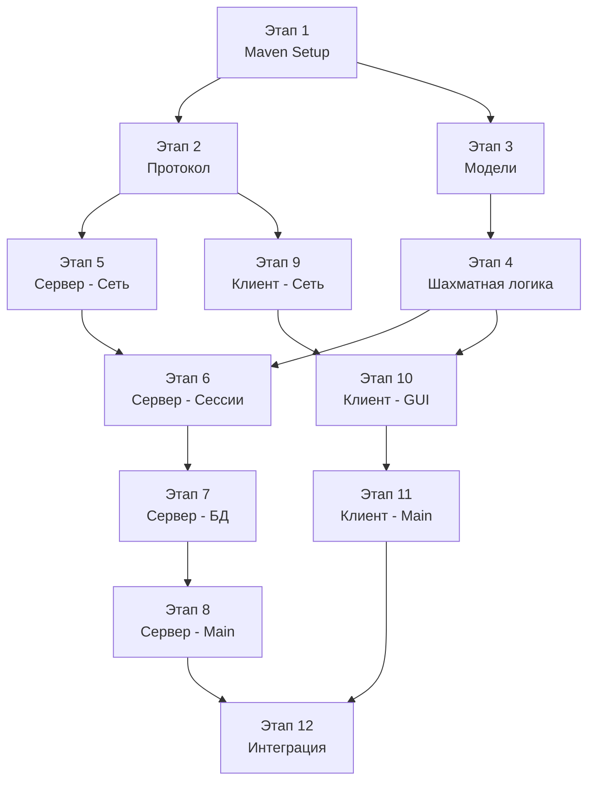

# ChessKSiS — План реализации

## Порядок создания файлов и этапы разработки

---

## Этап 1: Настройка проекта (Maven Multi-Module)

### Задачи:
- [ ] Создать родительский `pom.xml` с модулями
- [ ] Создать `chess-common/pom.xml`
- [ ] Создать `chess-server/pom.xml`
- [ ] Создать `chess-client/pom.xml`
- [ ] Удалить `src/Main.java` (шаблон IntelliJ)
- [ ] Создать `.gitignore` для Maven/IntelliJ

### Файлы:
1. `pom.xml` — родительский POM
2. `chess-common/pom.xml`
3. `chess-server/pom.xml`
4. `chess-client/pom.xml`
5. `database/schema.sql`

---

## Этап 2: Общий модуль — Протокол (chess-common)

### Задачи:
- [ ] Реализовать `MessageType` — перечисление всех типов сообщений
- [ ] Реализовать `Message` — класс сообщения с парсингом и сериализацией
- [ ] Реализовать `ProtocolException` — исключение протокола

### Файлы:
1. `chess-common/src/main/java/com/chess/common/protocol/MessageType.java`
2. `chess-common/src/main/java/com/chess/common/protocol/Message.java`
3. `chess-common/src/main/java/com/chess/common/protocol/ProtocolException.java`

---

## Этап 3: Общий модуль — Модели (chess-common)

### Задачи:
- [ ] Реализовать `GameColor` — перечисление WHITE/BLACK
- [ ] Реализовать `PieceType` — перечисление типов фигур
- [ ] Реализовать `Position` — координаты клетки с конвертацией в алгебраическую нотацию
- [ ] Реализовать `Piece` — фигура (тип + цвет + флаг hasMoved)
- [ ] Реализовать `Move` — ход (from, to, promotion, capture, en passant, castling)

### Файлы:
1. `chess-common/src/main/java/com/chess/common/model/GameColor.java`
2. `chess-common/src/main/java/com/chess/common/model/PieceType.java`
3. `chess-common/src/main/java/com/chess/common/model/Position.java`
4. `chess-common/src/main/java/com/chess/common/model/Piece.java`
5. `chess-common/src/main/java/com/chess/common/model/Move.java`

---

## Этап 4: Общий модуль — Шахматная логика (chess-common)

### Задачи:
- [ ] Реализовать `Board` — основная модель доски (8×8, FEN, инициализация)
- [ ] Реализовать интерфейс `PieceRule` и классы правил для каждой фигуры:
  - `PawnRule` — включая en passant и двойной ход
  - `KnightRule`
  - `BishopRule`
  - `RookRule`
  - `QueenRule`
  - `KingRule` — включая рокировку
- [ ] Реализовать `MoveValidator` — валидация ходов, проверка шаха, генерация легальных ходов
- [ ] Реализовать `GameStatus` — перечисление состояний партии
- [ ] Реализовать проверку мата, пата, ничьи (50 ходов, троекратное повторение, недостаток материала)

### Файлы:
1. `chess-common/src/main/java/com/chess/common/game/Board.java`
2. `chess-common/src/main/java/com/chess/common/game/rules/PieceRule.java`
3. `chess-common/src/main/java/com/chess/common/game/rules/PawnRule.java`
4. `chess-common/src/main/java/com/chess/common/game/rules/KnightRule.java`
5. `chess-common/src/main/java/com/chess/common/game/rules/BishopRule.java`
6. `chess-common/src/main/java/com/chess/common/game/rules/RookRule.java`
7. `chess-common/src/main/java/com/chess/common/game/rules/QueenRule.java`
8. `chess-common/src/main/java/com/chess/common/game/rules/KingRule.java`
9. `chess-common/src/main/java/com/chess/common/game/MoveValidator.java`
10. `chess-common/src/main/java/com/chess/common/game/GameStatus.java`

---

## Этап 5: Сервер — Сетевая часть (chess-server)

### Задачи:
- [ ] Реализовать `ServerConfig` — загрузка настроек из properties
- [ ] Реализовать `ChessServer` — ServerSocket, accept loop, ExecutorService
- [ ] Реализовать `ClientHandler` — поток обработки клиента (чтение/запись сообщений)
- [ ] Реализовать `MessageRouter` — маршрутизация сообщений по типу

### Файлы:
1. `chess-server/src/main/java/com/chess/server/config/ServerConfig.java`
2. `chess-server/src/main/java/com/chess/server/net/ChessServer.java`
3. `chess-server/src/main/java/com/chess/server/net/ClientHandler.java`
4. `chess-server/src/main/java/com/chess/server/net/MessageRouter.java`
5. `chess-server/src/main/resources/server.properties`

---

## Этап 6: Сервер — Игровые сессии (chess-server)

### Задачи:
- [ ] Реализовать `PlayerSession` — данные подключённого игрока
- [ ] Реализовать `RoomState` — перечисление состояний комнаты
- [ ] Реализовать `GameRoom` — игровая комната (2 игрока, доска, ходы)
- [ ] Реализовать `GameManager` — управление комнатами (создание, удаление, поиск)

### Файлы:
1. `chess-server/src/main/java/com/chess/server/session/PlayerSession.java`
2. `chess-server/src/main/java/com/chess/server/session/RoomState.java`
3. `chess-server/src/main/java/com/chess/server/session/GameRoom.java`
4. `chess-server/src/main/java/com/chess/server/session/GameManager.java`

---

## Этап 7: Сервер — База данных (chess-server)

### Задачи:
- [ ] Создать базу данных и таблицы (выполнить `schema.sql`)
- [ ] Реализовать `DatabaseManager` — управление соединением с MySQL
- [ ] Реализовать `UserDAO` — CRUD пользователей
- [ ] Реализовать `GameDAO` — сохранение партий и ходов
- [ ] Реализовать `AuthService` — регистрация и авторизация (хеширование SHA-256)
- [ ] Реализовать `RatingService` — расчёт рейтинга (ELO-подобная система)

### Файлы:
1. `database/schema.sql`
2. `chess-server/src/main/java/com/chess/server/db/DatabaseManager.java`
3. `chess-server/src/main/java/com/chess/server/db/UserDAO.java`
4. `chess-server/src/main/java/com/chess/server/db/GameDAO.java`
5. `chess-server/src/main/java/com/chess/server/service/AuthService.java`
6. `chess-server/src/main/java/com/chess/server/service/RatingService.java`

---

## Этап 8: Сервер — Точка входа (chess-server)

### Задачи:
- [ ] Реализовать `ServerApp` — main(), инициализация всех компонентов, graceful shutdown

### Файлы:
1. `chess-server/src/main/java/com/chess/server/ServerApp.java`

---

## Этап 9: Клиент — Сетевая часть (chess-client)

### Задачи:
- [ ] Реализовать `ServerConnection` — подключение к серверу, отправка сообщений
- [ ] Реализовать `MessageReceiver` — фоновый поток чтения сообщений
- [ ] Реализовать `MessageListener` — интерфейс обработчика сообщений

### Файлы:
1. `chess-client/src/main/java/com/chess/client/net/ServerConnection.java`
2. `chess-client/src/main/java/com/chess/client/net/MessageReceiver.java`
3. `chess-client/src/main/java/com/chess/client/net/MessageListener.java`

---

## Этап 10: Клиент — GUI (chess-client)

### Задачи:
- [ ] Создать FXML-разметку для экранов: login, register, lobby, game
- [ ] Реализовать `SceneNavigator` — навигация между экранами
- [ ] Реализовать `LoginController` — экран входа
- [ ] Реализовать `RegisterController` — экран регистрации
- [ ] Реализовать `LobbyController` — список комнат, создание/подключение
- [ ] Реализовать `ChessBoardWidget` — кастомный компонент шахматной доски
- [ ] Реализовать `GameController` — игровой экран, обработка ходов

### Файлы:
1. `chess-client/src/main/resources/view/login.fxml`
2. `chess-client/src/main/resources/view/register.fxml`
3. `chess-client/src/main/resources/view/lobby.fxml`
4. `chess-client/src/main/resources/view/game.fxml`
5. `chess-client/src/main/java/com/chess/client/util/SceneNavigator.java`
6. `chess-client/src/main/java/com/chess/client/controller/LoginController.java`
7. `chess-client/src/main/java/com/chess/client/controller/RegisterController.java`
8. `chess-client/src/main/java/com/chess/client/controller/LobbyController.java`
9. `chess-client/src/main/java/com/chess/client/util/ChessBoardWidget.java`
10. `chess-client/src/main/java/com/chess/client/controller/GameController.java`

---

## Этап 11: Клиент — Точка входа (chess-client)

### Задачи:
- [ ] Реализовать `ClientApp` — main(), запуск JavaFX, загрузка настроек

### Файлы:
1. `chess-client/src/main/java/com/chess/client/ClientApp.java`
2. `chess-client/src/main/resources/client.properties`

---

## Этап 12: Интеграция и тестирование

### Задачи:
- [ ] Запустить сервер, проверить подключение одного клиента
- [ ] Протестировать авторизацию и регистрацию
- [ ] Протестировать создание комнаты и подключение второго игрока
- [ ] Протестировать полную партию (ходы, взятия, рокировка, превращение, мат)
- [ ] Протестировать обработку отключений
- [ ] Протестировать в локальной сети (2 разных компьютера)
- [ ] Проверить сохранение результатов в MySQL

---

## Итого файлов к созданию: ~45

### Структура зависимостей между этапами:

